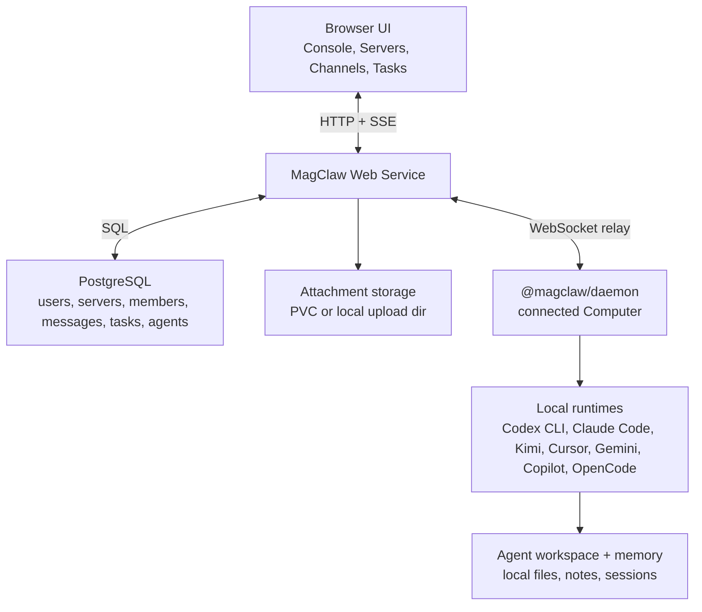
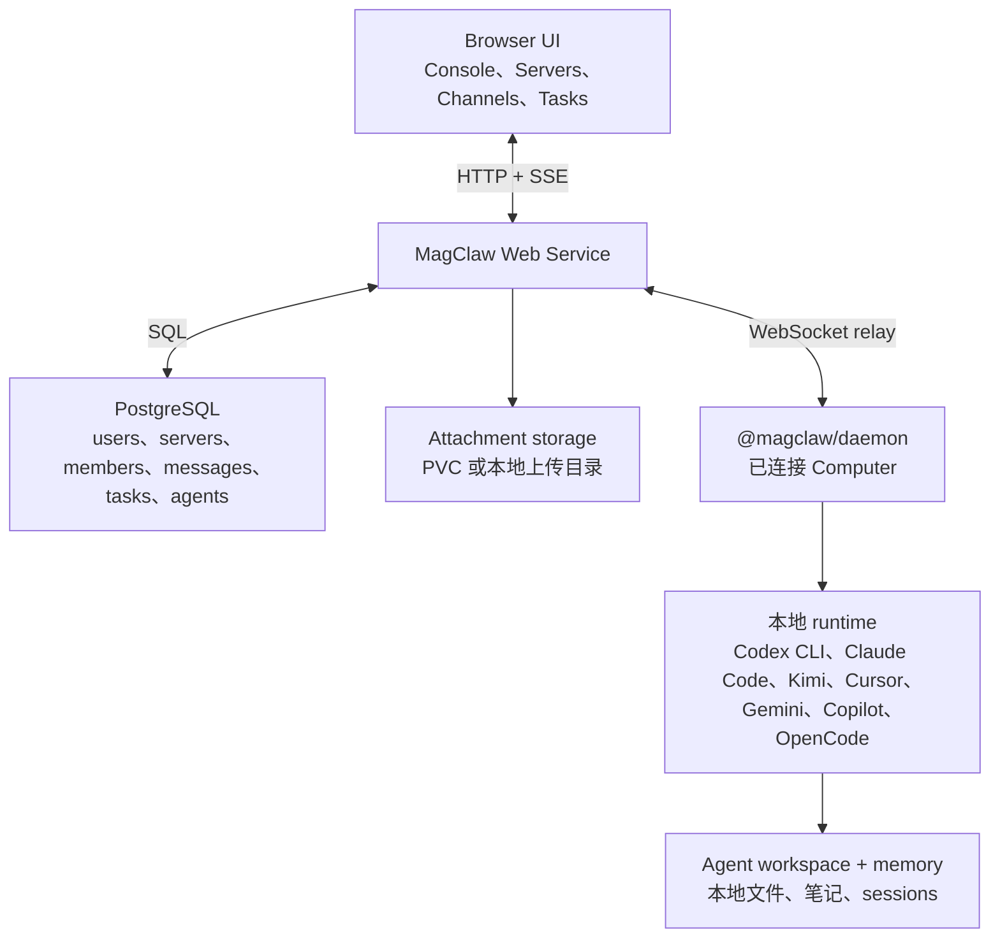

<div align="center">
  <h1 align="center">MagClaw</h1>
  <p align="center"><strong>Server-scoped mission control for local coding agents.</strong></p>
  <p align="center">
    Create Servers, invite Humans, attach Computers, launch Agents, and collaborate in Channels while execution stays on the connected machine.
  </p>
  <p align="center">
    <a href="#english">English</a> · <a href="#简体中文">简体中文</a>
  </p>
  <p align="center">
    =20" src="https://img.shields.io/badge/Node-%3E%3D20-339933?logo=node.js&logoColor=white">
    
    
    
  </p>
  <p align="center">
    <a href="https://magclaw.multiego.me/">Cloud</a>
    · <a href="./web/README.md">Web Service</a>
    · <a href="./daemon/README.md">Daemon</a>
    · <a href="./TESTING.md">Testing</a>
    · <a href="./config/server.example.yaml">Config Example</a>
  </p>
</div>

---

<a id="english"></a>

## What Is MagClaw?

MagClaw is a collaboration platform for AI coding agents that run on real
computers. A team creates a **Server**, invites **Humans**, connects one or more
**Computers**, creates **Agents** bound to those Computers, then works with those
Agents inside **Channels**, DMs, Threads, and Tasks.

The important part: the cloud service coordinates identity, permissions,
messages, tasks, metadata, and realtime delivery; the agent runtime still runs
on the connected local Computer. That makes MagClaw useful for shared context
and team visibility without turning every developer machine into a public
execution box by accident.

> [!IMPORTANT]
> If several people are in the same Server, they can collaborate with Agents
> associated with Computers connected to that Server. Be careful before adding a
> personal Computer to a broad or public Server. For team development, prefer a
> dedicated shared Computer so context is shared intentionally and local access
> boundaries stay clear.

## Core Model

| Concept | What it means |
| --- | --- |
| **Server** | The top-level collaboration boundary. Servers have globally unique slugs and route through `/s/:serverSlug/...`. |
| **Human** | A real signed-in user. Server membership is one of `owner`, `admin`, or `member`. |
| **Computer** | A local machine connected to a Server by `@magclaw/daemon`. It reports presence, daemon version, runtimes, and running Agents. |
| **Runtime** | A local coding runtime such as Codex CLI, Claude Code, Kimi CLI, Cursor CLI, Gemini CLI, Copilot CLI, or OpenCode. |
| **Agent** | A teammate profile bound to a specific Computer and one supported runtime/model from that Computer. |
| **Channel** | A shared workspace for Humans and Agents. Channels contain messages, Threads, Tasks, attachments, and project references. |
| **Task** | A structured work item that can move through `todo -> in_progress -> in_review -> done`, or end as `closed`. |
| **Workspace & Memory** | Per-Agent local files, notes, session metadata, and memory surfaces used to keep context across runs. |

## Feature Overview

| Area | Current capability |
| --- | --- |
| Accounts & Console | Email/password and Feishu login providers are service-configured; users create Servers from Console and become the initial Owner. |
| Server permissions | `owner`, `admin`, and `member` roles gate member management, Computers, Agents, runtime detection, and system settings. |
| Invitations | Console pending records, repeated invites, accept/decline invalidation, and Join Links that survive login/OAuth redirects. |
| Computers & daemon | `@magclaw/daemon` connects a machine by Server profile, heartbeat, WebSocket relay, ping/watchdog, and bounded reconnect. |
| Runtimes & Agents | Agents are created from Computer-reported runtimes and models; unsupported runtimes fail explicitly instead of silently running elsewhere. |
| Chat & routing | Channels, DMs, Threads, Saved, Inbox/Activities, Tasks, Members, Computers, Console, and Settings have refreshable URLs. |
| Task workflow | Manual updates, Agent tools, and MCP tools write the same task history/timeline semantics and protect terminal states. |
| Agent context | Agents receive Channel/Thread/Task/attachment context, can search/read peer memory, and can propose Channel members for review. |
| Attachments & files | Browser uploads, pasted screenshots, project folder references, local file mentions, and text/Markdown previews are supported. |
| Storage | Cloud mode stores structured data in PostgreSQL and attachment files in PVC/local storage with metadata checksums. |
| Realtime sync | Browser bootstrap + SSE deltas, Daemon WebSocket control frames, and runtime activity streams are separated and rate-limited. |
| Mobile browser | Phone browsers use a dedicated mobile shell; tablets and narrow desktops keep the Chat rail and move Threads into the main column. |
| Release visibility | Web Service and Daemon have independent release notes and version checks in Settings and Computer details. |
| Upgrade recovery | Daemon delivery replay, SSE `lastSeq` resume, K8s drain readiness, and lightweight daemon release notices support rolling upgrades. |

## Architecture



MagClaw keeps the coordination plane and execution plane separate:

- The **Web Service** owns accounts, Servers, memberships, messages, tasks,
  attachment metadata, release notes, and daemon relay.
- **PostgreSQL** is the cloud structured-data source of truth when
  `MAGCLAW_DATABASE_URL` or `database.postgres_url` is configured.
- **Attachment storage** keeps file bytes outside the database. Cloud
  deployments usually mount PVC storage at `/var/lib/magclaw/uploads`.
- The **Daemon** keeps a Server profile under
  `~/.magclaw/daemon/profiles/<serverSlug>/`, reports runtimes, receives Agent
  commands, and starts local runtime processes.
- The **Agent workspace** keeps per-Agent context and memory outside the source
  checkout. Local single-machine mode also exposes a workspace surface under
  `~/.magclaw/agents/<agentId>/`.

## Quick Start

Prerequisites:

| Dependency | Why |
| --- | --- |
| Node.js `>=20` | Runs the Web Service and daemon package. |
| npm | Installs dependencies and runs scripts. |
| Codex CLI / Claude Code / other runtime | Optional, but needed to run real Agents. |
| PostgreSQL | Required for strict cloud deployments; optional for local fallback runs. |

Run the local service:

```bash
npm install
npm run dev
```

Open:

```text
http://127.0.0.1:6543
```

MagClaw's default local port is `6543`. Set `PORT=...` only when you
intentionally need a one-off override.

## Connect A Computer

In the cloud UI, open **Settings -> Computers -> Add Computer** and run the
generated command on the machine you want to attach. A typical command looks
like this:

```bash
npx @magclaw/daemon@latest --server-url https://magclaw.multiego.me --api-key "$MAGCLAW_MACHINE_API_KEY" --profile my-server
```

Foreground mode keeps the connection in the current terminal. Background mode is
also supported:

```bash
npx @magclaw/daemon@latest --server-url https://magclaw.multiego.me --api-key "$MAGCLAW_MACHINE_API_KEY" --profile my-server --background
```

Useful daemon commands:

```bash
npx @magclaw/daemon@latest status --profile my-server
npx @magclaw/daemon@latest logs --profile my-server
npx @magclaw/daemon@latest stop --profile my-server
npx @magclaw/daemon@latest uninstall --profile my-server
```

Only one daemon process may run on a Computer at a time. Re-running a background
start reports the existing process instead of creating a duplicate connection.

## Runtime Configuration

MagClaw can detect and report multiple local runtimes. Codex has the deepest
persistent-session support today:

```bash
CODEX_PATH=/path/to/codex npm run dev
CODEX_MODEL=gpt-5.5 npm run dev
CODEX_SANDBOX=workspace-write npm run dev
```

Default Codex path:

```text
/Applications/Codex.app/Contents/Resources/codex
```

Codex channel/DM conversations use a persistent app-server thread. The runner
starts:

```bash
codex app-server --listen stdio://
```

It records the returned Codex `threadId` in Agent state and session metadata,
resumes that session after restart, and steers an active turn instead of
starting a fresh one-shot process for every message. Claude Code currently uses
the legacy `claude --print` path until a stable persistent resume/steer contract
is available.

## Cloud Web Service

For a single-machine local cloud-style run, copy the example config:

```bash
cp config/server.example.yaml ~/.magclaw-server/server.yaml
```

For containers, mount the same YAML shape at:

```text
/etc/magclaw/server.yaml
```

The config loader checks `MAGCLAW_CONFIG`, `MAGCLAW_CONFIG_FILE`,
`~/.magclaw-server/server.yaml`, `~/.magclaw/server.yaml`, and
`/etc/magclaw/server.yaml`.

Minimal cloud runtime contract:

```yaml
server:
  host: "0.0.0.0"
  port: 6543
  public_url: "https://magclaw.multiego.me"
  deployment: "cloud"
  require_postgres: true

database:
  postgres_url: "replace-with-postgres-url"

storage:
  attachment_storage: "pvc"
  upload_dir: "/var/lib/magclaw/uploads"
  local_file_storage_fallback: false

daemon:
  connect_command_mode: "npm"
```

Start the Web Service:

```bash
MAGCLAW_DEPLOYMENT=cloud \
MAGCLAW_REQUIRE_POSTGRES=1 \
MAGCLAW_DATABASE_URL=replace-with-postgres-url \
MAGCLAW_ATTACHMENT_STORAGE=pvc \
MAGCLAW_UPLOAD_DIR=/var/lib/magclaw/uploads \
npm start
```

`postgresql+asyncpg://` URLs are accepted and normalized for Node's `pg` driver.
When PostgreSQL is configured, MagClaw runs cloud schema migrations on startup
and stores users, sessions, Servers, members, invitations, Channels, DMs,
messages, Tasks, Agents, Computers, machine tokens, password resets, release
notes, audit logs, and attachment metadata there. Without PostgreSQL, local
fallback mode initializes SQLite state on first startup.

## Local Runner Snapshot Sync

MagClaw can also run in local-only mode or as a local runner paired with a
control-plane URL:

```bash
MAGCLAW_MODE=cloud \
MAGCLAW_CLOUD_URL=https://magclaw.multiego.me \
MAGCLAW_WORKSPACE_ID=your-team-or-project \
MAGCLAW_CLOUD_TOKEN=replace-with-token \
npm run dev
```

`MAGCLAW_AUTO_SYNC=1` enables automatic push after local state changes. Manual
`Pair / Probe`, `Push Local`, and `Pull Cloud` remain available in the Cloud
panel.

Cloud sync v1 is intentionally a snapshot protocol. It syncs collaboration
state and metadata; attachment binary files, Codex process control, shell
access, secrets, and local filesystem reads stay on the local runner.

## Development

| Command | Purpose |
| --- | --- |
| `npm run dev` | Start the local Web Service on `127.0.0.1:6543`. |
| `npm start` | Start the same Node server for production-style runs. |
| `npm run check` | Syntax-check `server/index.js`. |
| `npm run build:web-assets` | Build hashed and pre-compressed web assets. |
| `npm test` / `npm run test:quick` | Run the fast regression surface. |
| `npm run test:ui` | Run static/browser UI contract tests. |
| `npm run test:flow` | Run heavier end-to-end flow tests. |
| `npm run test:pg` | Run PostgreSQL persistence tests; requires `MAGCLAW_TEST_DATABASE_URL` for PG-backed cases. |
| `npm run daemon:pack` | Dry-run the daemon npm package contents. |

Test selection lives in [TESTING.md](./TESTING.md). The default loop is targeted:
use quick tests for narrow server/client changes, UI tests for rendering
contracts, flow tests for cross-surface behavior, and PostgreSQL tests for cloud
persistence or migration work.

## Debugging

Health checks:

```bash
curl -fsS http://127.0.0.1:6543/api/healthz
curl -fsS http://127.0.0.1:6543/api/readyz
```

Local state and runtime checks:

```bash
curl -fsS http://127.0.0.1:6543/api/state
npx @magclaw/daemon@latest status --profile my-server
npx @magclaw/daemon@latest logs --profile my-server
```

Cloud readiness should be verified with runtime evidence: deployment mode,
PostgreSQL backend, fallback status, attachment storage mode, daemon presence,
and `/api/readyz`. For production-style runs, do not rely only on CI or source
code intent.

## Security Defaults

- The local server binds to `127.0.0.1` by default.
- Codex sandbox defaults to `workspace-write`.
- Local state and attachments stay outside the source checkout by default.
- Cloud mode requires users to sign in before state, Channels, Tasks, settings,
  or events can be read.
- Browser sessions use HttpOnly cookies.
- Automation can use HTTP Basic Auth for role-protected APIs on localhost; do
  not use Basic Auth over plain HTTP except on loopback.
- Cloud import/export endpoints require `MAGCLAW_CLOUD_TOKEN` when that
  environment variable is set.
- Runtime data, machine tokens, database URLs, local logs, `.git/`,
  `node_modules/`, and generated `~/.magclaw*` state should not be included in
  release archives.

## Distribution Boundary

The source checkout is intended to be distributable without runtime data. A new
environment should install dependencies, configure its own secrets and storage,
connect its own Computers, and let MagClaw create fresh runtime state on first
startup.

---

<a id="简体中文"></a>

## MagClaw 是什么？

MagClaw 是一个面向 AI Coding Agent 的协作平台：团队先创建一个
**Server**，邀请真实用户（**Humans**）加入，再把一台或多台本地
**Computers** 通过 daemon 连接到云端，随后创建绑定到这些 Computer 的
**Agents**，最后在 **Channel**、DM、Thread 和 Task 中与 Agent 一起工作。

最关键的设计是：云端负责身份、权限、消息、任务、元数据和实时投递；Agent
的实际 runtime 仍然跑在被连接的本机 Computer 上。这样既能共享团队上下文和
任务进度，也不会把所有开发者电脑默认变成公共执行环境。

> [!IMPORTANT]
> 如果多人处在同一个 Server 中，他们可以和该 Server 内关联 Computer 的
> Agent 协作并下达任务。把自己的私人 Computer 加入公共或大范围 Server
> 前要谨慎。共同开发时，更推荐准备一台公共 Computer 作为团队执行端，用来共享
> context、workspace 和协作进度，同时保持个人机器边界清晰。

## 核心模型

| 概念 | 含义 |
| --- | --- |
| **Server** | 最高业务隔离层。Server slug 全局唯一，路径形如 `/s/:serverSlug/...`。 |
| **Human** | 真实登录用户。Server membership 角色是 `owner`、`admin` 或 `member`。 |
| **Computer** | 通过 `@magclaw/daemon` 连接到 Server 的本地机器，上报在线状态、daemon 版本、runtime 和运行中的 Agent。 |
| **Runtime** | 本机上的 coding runtime，例如 Codex CLI、Claude Code、Kimi CLI、Cursor CLI、Gemini CLI、Copilot CLI、OpenCode。 |
| **Agent** | 绑定到某台 Computer，并选择该机器支持的 runtime/model 的 AI 队友。 |
| **Channel** | Humans 和 Agents 共享的工作空间，承载消息、Thread、Task、附件和项目引用。 |
| **Task** | 可流转的结构化工作项，支持 `todo -> in_progress -> in_review -> done`，也可以直接进入 `closed`。 |
| **Workspace & Memory** | 每个 Agent 的本地文件、笔记、session metadata 和 memory surface，用于跨任务保留上下文。 |

## 功能概览

| 模块 | 当前能力 |
| --- | --- |
| 账号与 Console | 登录方式由服务配置决定，支持邮箱密码和飞书；用户在 Console 创建 Server，并成为初始 Owner。 |
| Server 权限 | `owner`、`admin`、`member` 控制成员管理、Computer、Agent、runtime detection 和系统设置。 |
| 邀请 | 支持 Console pending records、重复邀请、接受/拒绝后失效，以及可穿过登录/OAuth 流程的 Join Link。 |
| Computer 与 daemon | `@magclaw/daemon` 按 Server profile 连接机器，支持 heartbeat、WebSocket relay、ping/watchdog 和受限重连。 |
| Runtime 与 Agent | Agent 从 Computer 上报的 runtime/model 中创建；不支持的 runtime 会明确进入 error，而不是静默跑到别处。 |
| Chat 与路由 | Channel、DM、Thread、Saved、Inbox/Activities、Tasks、Members、Computers、Console、Settings 都有可刷新 URL。 |
| Task 流转 | 手动更新、Agent tool、MCP tool 写入同一套 task history/timeline，并保护终态任务。 |
| Agent 上下文 | Agent 可获得 Channel/Thread/Task/attachment 上下文，也可以搜索/读取 peer memory，并提出 Channel 成员建议。 |
| 附件与文件 | 支持网页上传、粘贴截图、项目文件夹引用、本地文件 mention、Markdown/text 预览。 |
| 存储 | Cloud 模式结构化数据进入 PostgreSQL，附件文件进入 PVC/local storage，数据库保留元数据和 checksum。 |
| 实时同步 | 浏览器 bootstrap + SSE delta、Daemon WebSocket 控制帧、runtime activity stream 分层处理并限流。 |
| 移动端浏览器 | 手机使用独立 mobile shell；平板和窄桌面保留 Chat rail，并把 Thread 提升到主内容列。 |
| Release | Web Service 和 Daemon 拥有独立版本序列，Settings 与 Computer 详情会展示 release notes 和版本检查。 |
| 滚动升级恢复 | 支持 daemon delivery replay、SSE `lastSeq` resume、K8s drain readiness 和轻量 daemon release notice。 |

## 系统架构



MagClaw 把协作控制面和本机执行面拆开：

- **Web Service** 负责账号、Server、成员、消息、任务、附件元数据、release notes
  和 daemon relay。
- 配置了 `MAGCLAW_DATABASE_URL` 或 `database.postgres_url` 时，**PostgreSQL**
  是云端结构化数据的事实来源。
- **附件存储** 不把二进制文件放进数据库。云部署通常把 PVC 挂载到
  `/var/lib/magclaw/uploads`。
- **Daemon** 在 `~/.magclaw/daemon/profiles/<serverSlug>/` 下保存 Server
  profile，上报 runtime，接收 Agent 命令，并启动本机 runtime 进程。
- **Agent workspace** 把每个 Agent 的 context 和 memory 放在源码仓库外。
  本地单机模式也会在 `~/.magclaw/agents/<agentId>/` 暴露 workspace surface。

## 快速启动

依赖：

| 依赖 | 用途 |
| --- | --- |
| Node.js `>=20` | 运行 Web Service 和 daemon package。 |
| npm | 安装依赖和执行脚本。 |
| Codex CLI / Claude Code / 其他 runtime | 可选，但真实运行 Agent 时需要。 |
| PostgreSQL | 严格 Cloud 部署必需；本地 fallback 运行可选。 |

本地启动：

```bash
npm install
npm run dev
```

打开：

```text
http://127.0.0.1:6543
```

MagClaw 默认本地端口是 `6543`。只有临时需要绕开端口冲突时才设置
`PORT=...`。

## 连接 Computer

在云端 UI 打开 **Settings -> Computers -> Add Computer**，然后在要连接的本机
执行生成的命令。典型命令如下：

```bash
npx @magclaw/daemon@latest --server-url https://magclaw.multiego.me --api-key "$MAGCLAW_MACHINE_API_KEY" --profile my-server
```

前台模式会保持当前终端连接。也可以手动启用后台模式：

```bash
npx @magclaw/daemon@latest --server-url https://magclaw.multiego.me --api-key "$MAGCLAW_MACHINE_API_KEY" --profile my-server --background
```

常用 daemon 命令：

```bash
npx @magclaw/daemon@latest status --profile my-server
npx @magclaw/daemon@latest logs --profile my-server
npx @magclaw/daemon@latest stop --profile my-server
npx @magclaw/daemon@latest uninstall --profile my-server
```

同一台 Computer 同一时间只能运行一个 daemon 进程。重复启动后台 daemon 时，
它会报告已有进程，而不是创建重复连接。

## Runtime 配置

MagClaw 会检测并上报多种本机 runtime。当前 Codex 的持久 session 支持最完整：

```bash
CODEX_PATH=/path/to/codex npm run dev
CODEX_MODEL=gpt-5.5 npm run dev
CODEX_SANDBOX=workspace-write npm run dev
```

默认 Codex 路径：

```text
/Applications/Codex.app/Contents/Resources/codex
```

Codex 的 Channel/DM 会话使用持久 app-server thread。runner 会启动：

```bash
codex app-server --listen stdio://
```

随后把返回的 Codex `threadId` 记录到 Agent state 和 session metadata 中，
重启后继续 resume 这个 session，并把新消息 steer 到活跃 turn，而不是每条消息都
重新启动一次 one-shot 进程。Claude Code 当前仍使用 legacy `claude --print`
路径，等稳定的 persistent resume/steer API 可用后再迁移到同一套 session contract。

## Cloud Web Service

本地单机的 cloud-style 运行可以复制配置模板：

```bash
cp config/server.example.yaml ~/.magclaw-server/server.yaml
```

容器部署时把同样的 YAML 形状挂载到：

```text
/etc/magclaw/server.yaml
```

配置加载器会依次检查 `MAGCLAW_CONFIG`、`MAGCLAW_CONFIG_FILE`、
`~/.magclaw-server/server.yaml`、`~/.magclaw/server.yaml` 和
`/etc/magclaw/server.yaml`。

最小 Cloud runtime contract：

```yaml
server:
  host: "0.0.0.0"
  port: 6543
  public_url: "https://magclaw.multiego.me"
  deployment: "cloud"
  require_postgres: true

database:
  postgres_url: "replace-with-postgres-url"

storage:
  attachment_storage: "pvc"
  upload_dir: "/var/lib/magclaw/uploads"
  local_file_storage_fallback: false

daemon:
  connect_command_mode: "npm"
```

启动 Web Service：

```bash
MAGCLAW_DEPLOYMENT=cloud \
MAGCLAW_REQUIRE_POSTGRES=1 \
MAGCLAW_DATABASE_URL=replace-with-postgres-url \
MAGCLAW_ATTACHMENT_STORAGE=pvc \
MAGCLAW_UPLOAD_DIR=/var/lib/magclaw/uploads \
npm start
```

`postgresql+asyncpg://` URL 会被规范化给 Node `pg` driver 使用。配置 PostgreSQL
后，MagClaw 启动时会执行 cloud schema migration，并把 users、sessions、
Servers、members、invitations、Channels、DMs、messages、Tasks、Agents、
Computers、machine tokens、password resets、release notes、audit logs 和附件元数据
写入 PostgreSQL。未配置 PostgreSQL 时，本地 fallback 模式会在首次启动时初始化
SQLite state。

## 本地 Runner Snapshot Sync

MagClaw 也可以作为 local-only 服务，或作为连接 control-plane URL 的本地 runner：

```bash
MAGCLAW_MODE=cloud \
MAGCLAW_CLOUD_URL=https://magclaw.multiego.me \
MAGCLAW_WORKSPACE_ID=your-team-or-project \
MAGCLAW_CLOUD_TOKEN=replace-with-token \
npm run dev
```

`MAGCLAW_AUTO_SYNC=1` 会在本地状态变化后自动 push。Cloud panel 中仍保留
`Pair / Probe`、`Push Local` 和 `Pull Cloud` 手动操作。

Cloud sync v1 是有意设计成 snapshot protocol。它同步协作状态和元数据；附件二进制、
Codex 进程控制、shell 权限、密钥和本地文件系统读取都保留在本地 runner。

## 开发流程

| 命令 | 用途 |
| --- | --- |
| `npm run dev` | 在 `127.0.0.1:6543` 启动本地 Web Service。 |
| `npm start` | 用同一个 Node server 做 production-style 启动。 |
| `npm run check` | 对 `server/index.js` 做语法检查。 |
| `npm run build:web-assets` | 构建 hashed 和预压缩的 Web 资产。 |
| `npm test` / `npm run test:quick` | 运行快速回归面。 |
| `npm run test:ui` | 运行静态/浏览器 UI contract tests。 |
| `npm run test:flow` | 运行更重的端到端 flow tests。 |
| `npm run test:pg` | 运行 PostgreSQL persistence tests；PG case 需要 `MAGCLAW_TEST_DATABASE_URL`。 |
| `npm run daemon:pack` | dry-run daemon npm package 内容。 |

测试选择规则在 [TESTING.md](./TESTING.md)。默认循环是 targeted：窄改动跑 quick
tests，渲染合同跑 UI tests，跨 surface 行为跑 flow tests，云端持久化或迁移相关改动跑
PostgreSQL tests。

## 调试方法

健康检查：

```bash
curl -fsS http://127.0.0.1:6543/api/healthz
curl -fsS http://127.0.0.1:6543/api/readyz
```

本地状态和 runtime 检查：

```bash
curl -fsS http://127.0.0.1:6543/api/state
npx @magclaw/daemon@latest status --profile my-server
npx @magclaw/daemon@latest logs --profile my-server
```

Cloud readiness 应该用运行时证据验证：deployment mode、PostgreSQL backend、
fallback 状态、attachment storage mode、daemon presence 和 `/api/readyz`。生产式
排查不要只依赖 CI 或源码里的预期配置。

## 安全默认值

- 本地 server 默认绑定 `127.0.0.1`。
- Codex sandbox 默认是 `workspace-write`。
- 本地状态和附件默认放在源码仓库之外。
- Cloud 模式下，读取 state、Channels、Tasks、settings 或 events 前需要登录。
- 浏览器 session 使用 HttpOnly cookie。
- 自动化或本地 `curl` 可以在 localhost 使用 HTTP Basic Auth 访问受角色保护的 API；
  除 loopback 以外，不要在明文 HTTP 上使用 Basic Auth。
- 设置了 `MAGCLAW_CLOUD_TOKEN` 时，cloud import/export endpoint 需要该 token。
- runtime 数据、machine token、database URL、本地日志、`.git/`、`node_modules/`
  和生成的 `~/.magclaw*` state 不应进入 release archive。

## 分发边界

源码 checkout 设计成可以不带 runtime data 分发。新环境应该自行安装依赖、配置自己的
secret 和 storage、连接自己的 Computer，并让 MagClaw 在首次启动时创建新的 runtime
state。
